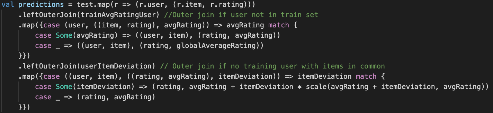

# Spark Recommender Systems

| |Overview  | 
| - | - |
|Course| CS-449 Systems for Data Science|
| Year | Spring 2021 |
| Final Grade | **5.75** / 6 |
| Languages | Scala, Apache Spark |
| Team size | 1 |

This repository showcases the different milestones realized within the EPFL CS-449 Systems for Data Science class in which I achieved a final grade of 5.75 on a 1 to 6 scale. Throughout the project, we implemented recommender systems of increasing complexity in Apache Spark and Scala. The project is organized as a succession of instructions to implement and argue within the milstone's report. Thus it is not a standalone project but a demonstration of how I can use Scala and Spark to handle Big Data.

The source code of each milestone is located under `MilestoneX/src/main/scala/`, for instance the predictions of the first Milestone are implemented in [Predictor.scala](./Milestone1/src/main/scala/predict/Predictor.scala).

A typical example of what the project consists of:
| Instruction|  |
|-|-|
|Implementation | |

If you are interested in more details, you can find the instructions of the 3 milestones in [instructions.pdf](./instructions.pdf) and the report of each milestone is named `report.pdf` in its respective folder.

